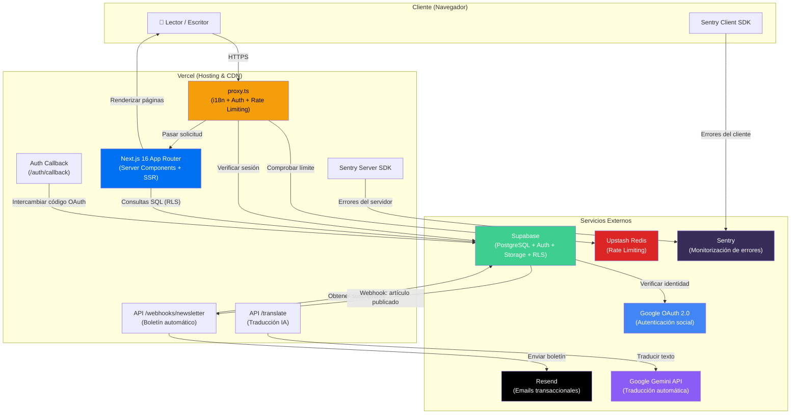

**Cerna Pensamento: Revista semanal de pensamiento, literatura y filosofía.**

Cerna es una plataforma digital bilingüe (gallego/castellano) construida como una revista literaria y filosófica moderna. Permite a sus escritores publicar artículos, ensayos, columnas, entrevistas, reportajes y poesía, y a sus lectores consumir, comentar y recibir notificaciones por correo electrónico cuando se publica contenido nuevo.

---

## Infraestructura



### Flujo de datos

1. **Solicitud entrante →** El navegador envía una petición HTTPS a Vercel.
2. **`proxy.ts` →** Intercepta la solicitud: detecta el idioma (GL/ES), verifica la sesión de Supabase y comprueba el *rate limit* con Upstash Redis.
3. **Next.js SSR →** Renderiza la página solicitada usando Server Components. Consulta la base de datos de Supabase mediante RLS (Row Level Security).
4. **Publicación de un artículo →** Cuando un escritor publica un artículo, Supabase dispara un Webhook que llama a la API `/api/webhooks/newsletter`. Esta API obtiene la lista de suscriptores y envía correos masivos a través de Resend.
5. **Monitorización →** Sentry captura errores tanto en el cliente como en el servidor, con Session Replay activado exclusivamente en sesiones con errores.

---

## Stack tecnológico

| Capa | Tecnología | Versión | Propósito |
|---|---|---|---|
| **Framework** | Next.js (App Router + Turbopack) | 16.2.9 | SSR, enrutamiento, API Routes |
| **UI** | React | 19.2.4 | Componentes reactivos |
| **Estilos** | Tailwind CSS | 4.x | Sistema de diseño utility-first |
| **Tipografía** | Google Fonts (Libre Caslon Text, Source Sans 3) | — | Tipografía serif/sans editorial |
| **Lenguaje** | TypeScript | 5.x | Tipado estático |
| **Base de datos** | Supabase (PostgreSQL) | — | Datos, autenticación, almacenamiento, RLS |
| **Autenticación** | Supabase Auth + Google OAuth 2.0 | — | Login social y por correo |
| **Rate Limiting** | Upstash Redis + @upstash/ratelimit | — | Protección contra abuso |
| **Emails** | Resend | — | Boletín de nuevos artículos |
| **Traducción IA** | Google Gemini (@google/genai) | — | Traducción automática GL↔ES |
| **Editor de texto** | Tiptap (ProseMirror) | 3.x | Editor WYSIWYG para escritores |
| **Monitorización** | Sentry (@sentry/nextjs) | 10.x | Errores, trazas y replay de sesiones |
| **Sanitización** | sanitize-html | — | Prevención XSS en contenido HTML |
| **i18n** | @formatjs/intl-localematcher + negotiator | — | Detección de idioma del navegador |
| **Hosting** | Vercel | — | Despliegue, CDN, Edge Functions |

---

## Estructura del proyecto

```
cerna/
├── database/
│   └── schema_global_actualizado.sql   # Esquema completo de la BD (PostgreSQL)
├── public/
│   └── images/
│       ├── columnistas/                 # Fotos de los columnistas
│       └── logo/                        # Logotipos de Cerna
├── src/
│   ├── actions/
│   │   └── auth.ts                      # Server Actions de autenticación
│   ├── app/
│   │   ├── api/
│   │   │   ├── translate/route.ts       # API de traducción con Gemini
│   │   │   └── webhooks/newsletter/     # Webhook del boletín (Resend)
│   │   ├── auth/
│   │   │   ├── callback/route.ts        # Callback OAuth de Supabase
│   │   │   └── confirm/route.ts         # Confirmación de correo
│   │   ├── [lang]/                      # Rutas con prefijo de idioma
│   │   │   ├── layout.tsx               # Layout raíz (tipografía, tema)
│   │   │   ├── page.tsx                 # Portada
│   │   │   ├── articulo/[slug]/         # Página individual de artículo
│   │   │   ├── articulos/               # Listado de artículos
│   │   │   ├── autor/[slug]/            # Perfil público del autor
│   │   │   ├── escritorio/              # Panel privado del escritor
│   │   │   │   ├── editar/[slug]/       # Editar artículo existente
│   │   │   │   ├── nuevo/               # Crear nuevo artículo
│   │   │   │   └── perfil/              # Gestión del perfil
│   │   │   ├── login/                   # Inicio de sesión
│   │   │   ├── recuperar-password/      # Recuperación de contraseña
│   │   │   ├── actualizar-password/     # Actualización de contraseña
│   │   │   ├── bases-editoriales/       # Normas editoriales
│   │   │   └── estatutos/               # Estatutos de la organización
│   │   ├── global-error.tsx             # Gestor de errores críticos (+ Sentry)
│   │   └── globals.css                  # Estilos globales y sistema de diseño
│   ├── components/
│   │   ├── escritorio/                  # Componentes del panel de escritor
│   │   ├── features/                    # Componentes de funcionalidad
│   │   ├── forms/                       # Formularios
│   │   ├── layout/                      # NavBar, Footer
│   │   ├── sections/                    # Secciones de la portada
│   │   └── ui/                          # Componentes genéricos (toggle, botón)
│   ├── dictionaries/
│   │   ├── es.json                      # Traducciones a castellano
│   │   ├── gl.json                      # Traducciones a gallego
│   │   ├── index.ts                     # Cargador de diccionarios (servidor)
│   │   └── client.ts                    # Cargador de diccionarios (cliente)
│   ├── hooks/
│   │   ├── useAuth.ts                   # Hook de autenticación
│   │   └── useLocale.ts                 # Hook de idioma actual
│   ├── lib/
│   │   ├── constants.ts                 # Constantes globales
│   │   └── editor/FigureExtension.ts    # Extensión de Tiptap para imágenes
│   ├── utils/
│   │   ├── auth.ts                      # Utilidades de autenticación
│   │   └── supabase/
│   │       ├── client.ts                # Cliente Supabase (navegador)
│   │       └── server.ts                # Cliente Supabase (servidor)
│   ├── i18n-config.ts                   # Configuración de idiomas (gl, es)
│   ├── instrumentation.ts              # Instrumentación Sentry (servidor/edge)
│   ├── instrumentation-client.ts       # Instrumentación Sentry (cliente)
│   └── proxy.ts                         # Proxy: i18n + Auth + Rate Limiting
├── sentry.server.config.ts              # Configuración Sentry servidor
├── sentry.edge.config.ts               # Configuración Sentry edge
├── next.config.ts                       # Configuración de Next.js + Sentry
├── tsconfig.json                        # Configuración de TypeScript
├── package.json                         # Dependencias y scripts
└── .env.local                           # Variables de entorno (NO subir a Git)
```

---

## Modelo de datos

### Tablas principales

| Tabla | Descripción |
|---|---|
| `perfiles` | Perfiles de usuario (nombre, bio, avatar, rol, preferencia de boletín) |
| `articulos` | Artículos publicados (título GL/ES, contenido GL/ES, estado, tipo, slug) |
| `comentarios` | Comentarios de los lectores en los artículos |
| `tags` | Etiquetas temáticas |
| `tag_translations` | Traducciones de las etiquetas (GL/ES) |
| `article_tags` | Relación N:N entre artículos y etiquetas |

### Roles de usuario

| Rol | Permisos |
|---|---|
| `usuario` | Leer artículos, comentar, gestionar su perfil |
| `escritor` | Todo lo anterior + crear y editar sus propios artículos |
| `admin` | Todo lo anterior + fijar artículos en la portada, eliminar contenido |
| `invitado` | Escritor temporal con cuota limitada (máx. 4 artículos, máx. 2/año) |

### Tipos de artículo

`artigo` · `ensaio` · `reportaxe` · `columna` · `entrevista` · `poesía`

---

## Seguridad

- **Row Level Security (RLS):** Todas las tablas públicas tienen políticas RLS activas. Los usuarios solo pueden modificar sus propios datos.
- **Rate Limiting:** Dos capas de protección mediante Upstash Redis:
  - API Routes: 10 solicitudes/minuto por IP.
  - Mutaciones globales (POST/PUT/DELETE): 30 solicitudes/minuto por IP.
- **Sanitización HTML:** Todo el contenido HTML de los artículos y comentarios se sanitiza con `sanitize-html` para prevenir ataques XSS.
- **Verificación de Webhooks:** El endpoint del boletín usa comparación criptográfica (`timingSafeEqual`) para validar la autenticidad de las solicitudes de Supabase.
- **Autenticación OAuth 2.0:** El login con Google está configurado a través de la cuenta oficial de la organización.

---

## Desarrollo local

```bash
# 1. Clonar el repositorio
git clone https://github.com/cernapensamento/cernapensamento-webpage.git
cd cernapensamento-webpage

# 2. Instalar dependencias
npm install

# 3. Configurar variables de entorno
cp .env.example .env.local
# Editar .env.local con tus claves

# 4. Iniciar el servidor de desarrollo
npm run dev
```

La aplicación estará disponible en `http://localhost:3000`.

### Scripts disponibles

| Comando | Descripción |
|---|---|
| `npm run dev` | Servidor de desarrollo con Turbopack |
| `npm run build` | Compilación de producción |
| `npm run start` | Servidor de producción |
| `npm run lint` | Análisis estático con ESLint |

---

## Despliegue

El proyecto se despliega automáticamente en **Vercel** cada vez que se hace `git push` a la rama `main`. Vercel proporciona:

- **CDN global** para assets estáticos.
- **Edge Functions** para el proxy de i18n y rate limiting.
- **Serverless Functions** para las API Routes.
- **Despliegues Blue/Green** con rollback instantáneo.
- **Preview Deployments** para cada pull request.

---

## Licencia

Proyecto privado de Cerna Pensamento. Todos los derechos reservados.
