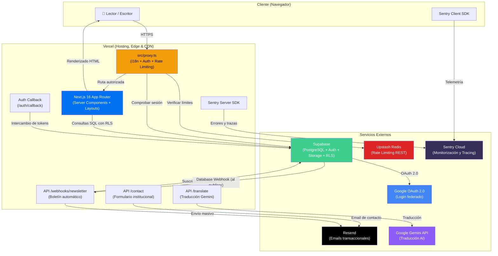

# Cerna Pensamento

> **Revista semanal de pensamiento, literatura y filosofía.**

Cerna es una plataforma editorial bilingüe (gallego/castellano) construida como una revista literaria y de pensamiento moderno. Permite a sus escritores redactar, maquetar con fórmulas y tablas, y publicar artículos, ensayos, columnas, reportajes y poesía; y a sus lectores consumir contenido con navegación fluida, comentar y recibir boletines informativos.

---

## Índice

1. [Arquitectura del Sistema](#arquitectura-del-sistema)
2. [Stack Tecnológico](#stack-tecnológico)
3. [Estructura del Proyecto](#estructura-del-proyecto)
4. [Módulos y Características Clave](#módulos-y-características-clave)
5. [Editor de Contenidos (TipTap Suite)](#editor-de-contenidos-tiptap-suite)
6. [Seguridad y Rendimiento](#seguridad-y-rendimiento)
7. [Desarrollo Local](#desarrollo-local)
8. [Mapas de Código (Codemaps)](#mapas-de-código-codemaps)
9. [Despliegue](#despliegue)

---

## Arquitectura del Sistema



### Flujo de Datos
1. **Petición Entrante**: El cliente solicita una página. `src/proxy.ts` resuelve la localización (`/gl` o `/es`), valida la sesión y aplica rate-limiting en Edge con Upstash Redis.
2. **Jerarquía de Layout**: `src/app/[lang]/layout.tsx` monta la barra de navegación persistente (`PublicNavBar`) y el proveedor de temas. Durante transiciones asíncronas, `loading.tsx` cubre la pantalla como overlay mientras la barra superior permanece fija.
3. **Persistencia y Acciones**: Las mutaciones de artículos se realizan mediante Server Actions (`src/actions/articles.ts`) y se guardan en Supabase PostgreSQL bajo estrictas políticas RLS.
4. **Automatización**: Al publicar un artículo, Supabase activa el webhook `/api/webhooks/newsletter` para notificar a los lectores vía Resend.

---

## Stack Tecnológico

| Capa | Tecnología | Versión | Propósito |
|---|---|---|---|
| **Framework** | Next.js (App Router + Turbopack) | 16.2.9 | SSR, Streaming, Server Actions, API Routes |
| **Biblioteca UI** | React | 19.2.4 | Componentes declarativos y Server Components |
| **Estilos** | Tailwind CSS | 4.x | Sistema de diseño utility-first y modo oscuro nativo |
| **Tipografía** | Google Fonts (Libre Caslon Text, Source Sans 3) | — | Identidad editorial serif y sans-serif |
| **Lenguaje** | TypeScript | 5.x | Tipado estático estricto |
| **Base de Datos & Auth** | Supabase (PostgreSQL + RLS) | — | Base de datos, autenticación, almacenamiento multimedia |
| **Rate Limiting** | Upstash Redis (@upstash/ratelimit) | — | Protección contra abuso en Edge |
| **Servicio de Email** | Resend | — | Formularios de contacto y boletín masivo |
| **Traducción IA** | Google Gemini (@google/genai) | 2.5 | Asistente de traducción editorial GL↔ES |
| **Editor WYSIWYG** | TipTap 3 (ProseMirror) | 3.x | Editor enriquecido para redactores |
| **Fórmulas Matemáticas** | KaTeX | 0.16.x | Renderizado de expresiones LaTeX en editor y lectura |
| **Seguridad HTML** | sanitize-html | 2.17.x | Sanitización estricta XSS para contenido editorial |
| **Observabilidad** | Sentry (@sentry/nextjs) | 10.x | Monitorización de errores y session replays |
| **Despliegue** | Vercel | — | Hosting global, Edge Middleware y CDN |

---

## Estructura del Proyecto

```
cerna/
├── database/
│   └── schema_global_actualizado.sql    # Esquema SQL completo de Supabase
├── docs/
│   ├── CODEMAPS/                        # Mapas arquitectónicos modulares
│   │   ├── INDEX.md                     # Índice de arquitectura
│   │   ├── frontend.md                  # Layouts, UI tokens, theming, i18n
│   │   ├── editor.md                    # TipTap, KaTeX, tablas, índice jerárquico
│   │   ├── backend.md                   # Edge proxy, server actions, API routes
│   │   ├── database.md                  # Esquema, RLS, storage buckets
│   │   └── integrations.md              # Servicios externos (Resend, Upstash, etc.)
│   └── *.md                             # Documentación institucional (estatutos, proyectos)
├── public/
│   └── images/                          # Logotipos y fotografías de autores
├── src/
│   ├── actions/                         # Server Actions autenticadas
│   │   ├── articles.ts                  # Guardado, publicación y borrado de artículos
│   │   └── auth.ts                      # Gestión de sesiones y credenciales
│   ├── app/
│   │   ├── api/                         # Route Handlers
│   │   │   ├── contact/route.ts         # Formulario de contacto con Resend
│   │   │   ├── translate/route.ts       # Traducción asistida con Gemini AI
│   │   │   └── webhooks/newsletter/     # Webhook de difusión de artículos
│   │   ├── auth/                        # Callbacks OAuth de Supabase
│   │   ├── [lang]/                      # Rutas localizadas (gl/es)
│   │   │   ├── layout.tsx               # Layout raíz con navbar persistente
│   │   │   ├── loading.tsx              # Overlay de pantalla completa para cargas
│   │   │   ├── page.tsx                 # Portada de la revista
│   │   │   ├── articulo/[slug]/         # Lector público con soporte KaTeX e índice
│   │   │   ├── articulos/               # Archivo y explorador con filtros
│   │   │   ├── asociacion/              # Portal institucional y colecciones
│   │   │   ├── autor/[slug]/            # Ficha pública de autores
│   │   │   ├── contacto/                # Página de contacto institucional
│   │   │   ├── escritorio/              # Panel de redacción y editor
│   │   │   ├── noticias/                # Canal de comunicados y novedades
│   │   │   └── login/                   # Autenticación de redactores
│   ├── components/
│   │   ├── escritorio/                  # ArticleEditor, TableControls, barras
│   │   ├── features/                    # ArticleCard, CommentsSection, filtros
│   │   ├── forms/                       # ContactForm, CommentForm, EditarArticuloForm
│   │   ├── layout/                      # PublicNavBar, SiteFooter, wrappers
│   │   ├── sections/                    # Bloques modulares de la portada
│   │   └── ui/                          # SocialLinks, ThemeToggle, LanguageToggle
│   ├── dictionaries/                    # Diccionarios de traducción (gl.json, es.json)
│   ├── hooks/                           # useAuth, useLocale
│   ├── lib/
│   │   ├── constants.ts                 # Constantes globales de la app
│   │   └── editor/                      # Extensiones TipTap, renderMath, generateIndex
│   ├── utils/                           # Clientes de Supabase y funciones de sesión
│   ├── proxy.ts                         # Edge Middleware (i18n + Auth + Rate Limiting)
│   └── globals.css                      # Variables de diseño y tema oscuro
├── .env.example                         # Plantilla de variables de entorno requeridas
├── package.json                         # Dependencias y scripts
└── tsconfig.json                        # Configuración estricta de TypeScript
```

---

## Módulos y Características Clave

### 1. Navegación Persistente y Transiciones Fluidas
- **Header Global**: `PublicNavBar` reside en el layout raíz, garantizando que el encabezado nunca desaparezca durante la navegación.
- **Control de Visibilidad**: `HeaderVisibilityWrapper` y `FooterVisibilityWrapper` ocultan dinámicamente la navegación pública en el panel de redacción (`/escritorio`) o en login.
- **Overlay de Carga**: `loading.tsx` implementa un overlay de pantalla completa (`z-40`) con el isotipo editorial animado, ocultando el footer durante la carga para evitar saltos de página.
- **Redes Sociales Unificadas**: `SocialLinks.tsx` centraliza los enlaces a LinkedIn, Instagram, X y contacto por correo.

### 2. Secciones Principales
- **Portada (`/`)**: Destacado principal, artículos fijados, columnistas, temáticas y manifiesto.
- **Artículos (`/articulos`)**: Archivo con filtrado interactivo por etiquetas y tipos.
- **Noticias (`/noticias`)**: Canal dedicado a comunicados y actualidad editorial.
- **Contacto (`/contacto`)**: Formulario con validación en cliente y servidor conectado a Resend.
- **Asociación (`/asociacion`)**: Colecciones editoriales (poesía, ensayo, narrativa) y estatutos legales.

---

## Editor de Contenidos (TipTap Suite)

El panel privado (`/escritorio/nuevo` y `/escritorio/editar/[slug]`) cuenta con un editor WYSIWYG de nivel profesional diseñado para publicaciones académicas y de ensayo:

1. **Fórmulas Matemáticas y Científicas**:
   - Soporte para sintaxis **LaTeX** en línea y en bloque mediante `@tiptap/extension-mathematics` y `katex`.
   - Renderizado seguro en el visor público mediante `renderMathInHtml.ts`.
2. **Tablas Dinámicas**:
   - Creación y edición de tablas con cabeceras, filas/columnas dinámicas y colores de fondo personalizados con `TableControls.tsx`.
3. **Índice Automático de Artículos (Table of Contents)**:
   - Generación automática de índices jerárquicos a partir de los encabezados `H1`, `H2` y `H3` del documento (`generateIndex.ts`).
   - Inyección automática de identificadores de anclaje (`renderHeadingAnchors.ts`) para navegación directa por secciones.
4. **Imágenes Semánticas**:
   - Extensión `FigureExtension` para fotografías con pie de autor y leyenda centrada.
5. **Traducción Asistida por IA**:
   - Integración con Google Gemini para traducir borradores completos entre gallego y castellano en un clic.

---

## Seguridad y Rendimiento

- **Row Level Security (RLS)**: Ninguna mutación a la base de datos se realiza sin comprobar la identidad y permisos del usuario en Supabase (`usuario`, `escritor`, `admin`, `invitado`).
- **Prevención de Ataques XSS**: Todo el contenido HTML proveniente del editor o de comentarios de lectores se procesa con una lista blanca estricta en `sanitize-html`.
- **Doble Capa de Rate Limiting**: Upstash Redis en Edge limita tanto peticiones a rutas API como mutaciones HTTP masivas.
- **Verificación Criptográfica de Webhooks**: La recepción del webhook de Supabase utiliza `crypto.timingSafeEqual` para validar la firma.

---

## Desarrollo Local

### Requisitos Previos
- Node.js 20+
- npm 10+
- Cuenta de Supabase, Upstash Redis y Resend configuradas.

### Instalación

```bash
# 1. Clonar el repositorio
git clone https://github.com/cernapensamento/cernapensamento-webpage.git
cd cernapensamento-webpage

# 2. Instalar dependencias
npm install

# 3. Configurar variables de entorno
cp .env.example .env.local
# Editar .env.local con las claves correspondientes

# 4. Iniciar servidor de desarrollo
npm run dev
```

La aplicación estará disponible en `http://localhost:3000`.

### Scripts Disponibles

| Comando | Descripción |
|---|---|
| `npm run dev` | Inicia el servidor de desarrollo con Turbopack |
| `npm run build` | Compila la aplicación para producción |
| `npm run start` | Inicia el servidor de producción |
| `npm run lint` | Ejecuta el análisis estático de código con ESLint |

---

## Mapas de Código (Codemaps)

Para profundizar en la arquitectura interna y detalles de implementación de cada módulo, consulta la documentación en `docs/CODEMAPS/`:

- [**Índice General**](docs/CODEMAPS/INDEX.md)
- [**Frontend & UI**](docs/CODEMAPS/frontend.md)
- [**Editor & Renderizado**](docs/CODEMAPS/editor.md)
- [**Backend & API**](docs/CODEMAPS/backend.md)
- [**Base de Datos & Storage**](docs/CODEMAPS/database.md)
- [**Integraciones Externas**](docs/CODEMAPS/integrations.md)

---

## Despliegue

El proyecto se despliega automáticamente en **Vercel** conectado al repositorio de GitHub:
- **Ramas de producción**: Cada commit a `main` desencadena un despliegue de producción con compilación optimizada en Turbopack.
- **Preview Deployments**: Cada Pull Request genera un entorno de previsualización con URL única para pruebas.

---

## Licencia

Proyecto privado de **Cerna Pensamento**. Todos los derechos reservados.
