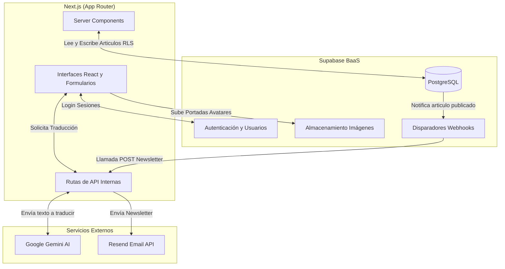

# CERNA Pensamento - Documentación del Proyecto

**Última actualización:** 19 de Julio de 2026

## 1. Visión General
**Cerna** es una plataforma editorial y de ensayos bilingüe (Gallego/Castellano). Permite a los escritores redactar, editar y publicar artículos usando un editor de texto enriquecido (WYSIWYG), e incluye funcionalidades avanzadas como traducción automática mediante Inteligencia Artificial, un sistema de roles para la gestión de usuarios, comentarios de los lectores y envío automatizado de newsletters.

## 2. Tecnologías Principales
El proyecto está construido sobre un stack moderno orientado al rendimiento y la escalabilidad:

*   **Framework Frontend/Backend:** [Next.js 16](https://nextjs.org/) (usando el App Router y React 19).
*   **Base de Datos y Backend as a Service:** [Supabase](https://supabase.com/) (PostgreSQL para datos, Auth para sesiones, Storage para imágenes).
*   **Estilos:** [Tailwind CSS v4](https://tailwindcss.com/) (configurado vía `postcss.config.mjs`).
*   **Editor de Texto Enriquecido:** [TipTap](https://tiptap.dev/) (basado en ProseMirror, con extensiones personalizadas para imágenes y YouTube).
*   **Inteligencia Artificial:** Google GenAI (Gemini 3.1 Flash Lite) para la traducción bilingüe.
*   **Envío de Correos:** [Resend](https://resend.com/) (integrado vía Webhooks de Supabase).
*   **Testing E2E:** [Playwright](https://playwright.dev/).

## 3. Arquitectura del Sistema

### Diagrama de la Arquitectura



### 3.1. Autenticación y Autorización
La aplicación utiliza Supabase Auth (Email + Contraseña y OAuth con Google).
Existen 3 roles definidos en la base de datos (tabla `perfiles`):
1.  **`admin`**: Acceso total al escritorio, puede editar/borrar cualquier artículo.
2.  **`escritor`**: Acceso al escritorio, puede crear, editar y borrar **sus propios** artículos.
3.  **`usuario` (lector)**: Solo puede acceder a la parte pública y a `/escritorio/perfil` para editar su biografía y suscripción a la newsletter. Puede dejar comentarios.

El acceso se protege en el servidor (RSC) mediante la utilidad `getAuthenticatedUser()` y en el cliente mediante el hook `useAuth()`.

### 3.2. Internacionalización (Bilingüismo)
La plataforma es nativamente bilingüe (Gallego y Castellano):
*   **Estado:** El idioma seleccionado se guarda en una cookie (`locale=gl` o `locale=es`).
*   **Base de datos:** La tabla `articulos` almacena columnas separadas para cada idioma (`titulo_gl`, `titulo_es`, `contenido_gl`, `contenido_es`, etc.).
*   **Traducción IA:** El editor de artículos (`ArticleEditor.tsx`) permite redactar en un idioma y llamar al endpoint `/api/translate`. Este endpoint usa la API de Google Gemini para traducir automáticamente el título, subtítulo y contenido HTML, preservando las etiquetas y el formato.

### 3.3. Sistema de Newsletter
Automatizado mediante la base de datos:
1.  Un artículo cambia su `estado` a `publicado`.
2.  Un **Webhook de Supabase** detecta este cambio e invoca el endpoint `/api/webhooks/newsletter`.
3.  El endpoint ejecuta un procedimiento almacenado (RPC) `get_subscribers_emails` en Supabase de forma segura para obtener la lista de usuarios suscritos.
4.  Se envía un correo electrónico en lote utilizando la API de **Resend**.

## 4. Modelos de Datos (Base de Datos)

La base de datos PostgreSQL en Supabase se compone principalmente de tres tablas, protegidas por políticas RLS (Row Level Security):

*   **`perfiles`**: Vinculada a `auth.users` (1:1). Almacena `id`, `nombre`, `slug` (URL amigable), `bio`, `avatar_url`, `recibir_newsletter` (booleano) y `rol`.
*   **`articulos`**: Almacena el contenido. Campos clave: `id`, `slug`, `titulo_gl/es`, `contenido_gl/es`, `imagen_url` (portada), `estado` (borrador/publicado), `tipo` (artigo, ensaio, etc.), `fijado` (destacado en inicio) y `autor_id` (FK a perfiles).
*   **`comentarios`**: Almacena los comentarios públicos. Campos: `id`, `articulo_id`, `autor_id`, `contenido`, `creado_en`.

*Nota: Los archivos subidos (portadas, imágenes integradas y avatares) se guardan en el bucket público `imagenes-articulos` de Supabase Storage.*

## 5. Estructura de Directorios

```text
/
├── database/               # Scripts SQL (esquema, migraciones, RLS, datos semilla).
├── public/                 # Assets estáticos e imágenes locales.
├── scripts/                # Scripts utilitarios (parseo, comprobación, testing en node).
├── tests/                  # Tests End-to-End con Playwright.
└── src/
    ├── app/                # Rutas de Next.js (App Router).
    │   ├── api/            # Endpoints backend (traducción, newsletter).
    │   ├── articulo/       # Páginas de lectura de artículos públicos (/articulo/[slug]).
    │   ├── autor/          # Páginas de perfil público de autores (/autor/[slug]).
    │   ├── escritorio/     # Panel de control privado (Dashboard, editor de artículos, perfil).
    │   ├── login/          # Flujo de autenticación.
    │   └── page.tsx        # Página de inicio pública (Home).
    ├── components/         # Componentes de React reutilizables.
    │   ├── escritorio/     # Componentes específicos del panel privado (ej. ArticleEditor.tsx).
    │   └── ...             # Componentes públicos (Navbar, Footer, ArticleCard, etc.).
    ├── hooks/              # Hooks personalizados de React (ej. useAuth).
    ├── lib/                # Constantes compartidas del proyecto.
    └── utils/              # Funciones de utilidad pura.
        └── supabase/       # Clientes de conexión a Supabase (client-side y server-side).
```

## 6. Flujos Principales de Usuario

### 6.1. Redacción y Publicación
1. Un **escritor** inicia sesión y accede a `/escritorio/nuevo`.
2. Utiliza el `ArticleEditor.tsx` (basado en TipTap) para redactar. Puede añadir imágenes (se suben al Storage), vídeos de YouTube, citas, etc.
3. Redacta en su idioma preferido y hace clic en "Traducir". El backend con IA genera la versión en el otro idioma.
4. El trabajo se autoguarda en el `localStorage` del navegador.
5. Al hacer clic en "Publicar", los datos se guardan en la tabla `articulos` y el webhook dispara la newsletter a los lectores.

### 6.2. Lectura y Navegación
1. Un **lector** visita la página de inicio. El servidor (RSC) carga los artículos destacados (`fijado = true`) y el feed cronológico.
2. La página utiliza ISR (Incremental Static Regeneration) con `revalidate = 60` segundos para un alto rendimiento.
3. El lector puede alternar el idioma de la web mediante el "Language Toggle", que cambia una cookie y recarga la interfaz y los textos de los artículos (gl ↔ es).
4. Si el lector inicia sesión, puede dejar comentarios al final de los artículos; la UI se actualiza de forma optimista (inmediata).

## 7. Notas de Diseño y Estilo
El diseño busca una estética literaria y editorial "premium":
*   Uso de tipografías contrastantes: **Libre Caslon Text** (serifa clásica) para los títulos y **Source Sans 3** (sans-serif) para el cuerpo.
*   Paleta de colores semántica: `parchment` (fondo pergamino), `charcoal` (texto carbón oscuro), `gold` (acentos dorados).
*   Se soporta Modo Oscuro, que invierte `parchment` y `charcoal` para una lectura nocturna cómoda.
*   Microinteracciones: Bordes afilados (sin border-radius) para un look más clásico, barras decorativas doradas que se animan al hacer hover, e iconos vectoriales estilo Material Symbols.
