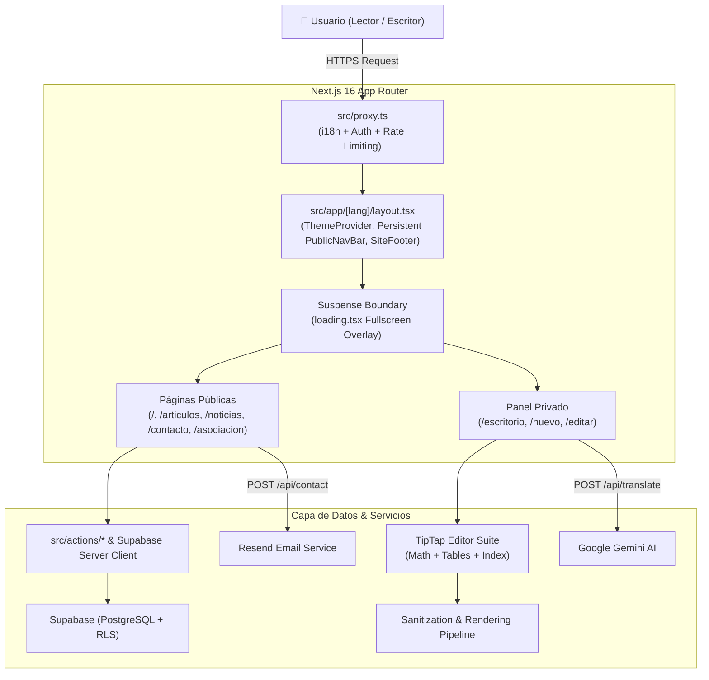

# Cerna Pensamento — Arquitectura y Mapa de Código (Codemaps)

**Última actualización:** 2026-09-17  
**Puntos de entrada principales:**
- Servidor / App Router: `src/app/[lang]/layout.tsx`
- Edge Middleware / Proxy: `src/proxy.ts`
- Editor de contenidos: `src/components/escritorio/ArticleEditor.tsx`
- Acciones de servidor: `src/actions/articles.ts`, `src/actions/auth.ts`

---

## Índice de Codemaps

Este directorio contiene los mapas arquitectónicos modulares del proyecto para facilitar el onboarding, la navegación y el mantenimiento del código:

| Codemap | Enfoque | Tecnologías Clave |
|---|---|---|
| [Frontend](frontend.md) | Next.js App Router, Jerarquía de layouts, Sistema de diseño, Theming, i18n | React 19, Next 16 App Router, Tailwind v4, ThemeProvider |
| [Editor](editor.md) | Editor WYSIWYG TipTap, Fórmulas KaTeX, Tablas avanzadas, Índice jerárquico, Sanitización | TipTap 3, KaTeX, ProseMirror, sanitize-html |
| [Backend](backend.md) | Proxy Edge, Server Actions, Endpoints API (`/api/translate`, `/api/contact`, etc.) | Next.js Server Actions, Edge Runtime, Resend, Gemini AI |
| [Base de Datos](database.md) | Esquema PostgreSQL, Tablas, Relaciones N:N, RLS (Row Level Security), Almacenamiento | Supabase, PostgreSQL, RLS, Storage Buckets |
| [Integraciones](integrations.md) | Servicios externos, Autenticación Google OAuth, Resend, Upstash Redis, Sentry | Supabase Auth, Resend, Upstash Redis, Google GenAI, Sentry |

---

## Diagrama General de Flujo



---

## Estructura de Directorios Clave

```
src/
├── actions/             # Server actions (artículos, autenticación)
├── app/                 # Rutas de Next.js App Router
│   ├── [lang]/          # Rutas internacionalizadas (gl/es)
│   │   ├── articulo/    # Lector individual de artículos
│   │   ├── articulos/   # Explorador y archivo de artículos
│   │   ├── asociacion/  # Páginas institucionales y colecciones
│   │   ├── contacto/    # Formulario institucional de contacto
│   │   ├── escritorio/  # Panel de administración y editor para redactores
│   │   └── noticias/    # Canal de novedades y comunicados
│   └── api/             # Endpoints HTTP (traducción, webhooks, contacto)
├── components/          # Componentes organizados por dominio
│   ├── escritorio/      # Editor, barras de herramientas y controles
│   ├── features/        # Tarjetas, comentarios, filtros y perfil
│   ├── forms/           # Formularios validados
│   ├── layout/          # Barra de navegación persistente, pie, menú lateral
│   ├── sections/        # Secciones modulares de la portada
│   └── ui/              # Componentes visuales genéricos y accesibles
├── dictionaries/        # Diccionarios i18n (es.json, gl.json)
├── hooks/               # Custom hooks de React (useAuth, useLocale)
├── lib/                 # Extensiones de TipTap, renderizado KaTeX y constantes
└── utils/               # Clientes de Supabase y autenticación
```
