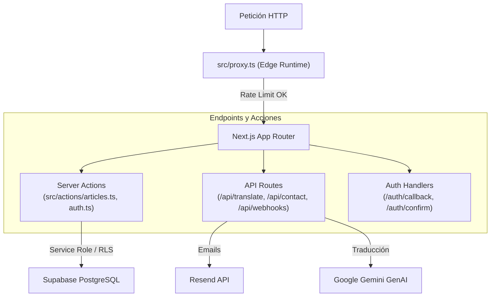

# Backend & API Codemap — Cerna Pensamento

**Última actualización:** 2026-09-17  
**Puntos de entrada:** `src/proxy.ts`, `src/actions/articles.ts`, `src/app/api/`

---

## 1. Arquitectura del Backend

Cerna opera con un backend híbrido sobre **Next.js 16**:
1. **Edge Middleware (`src/proxy.ts`)**: Control de acceso perimetral, rate limiting y resolución de internacionalización.
2. **Server Actions (`src/actions/`)**: Mutaciones seguras y autenticadas desde el cliente.
3. **Route Handlers (`src/app/api/`)**: Endpoints HTTP para integraciones externas y tareas automáticas.

---

## 2. Edge Middleware / Proxy (`src/proxy.ts`)

Se ejecuta en el Edge antes de procesar cualquier ruta de la aplicación:
- **Detección de Idioma (i18n)**: Detecta `gl` o `es` mediante cookies y cabeceras `Accept-Language` usando `@formatjs/intl-localematcher`. Redirige `/` a `/{locale}`.
- **Protección de Rutas Privadas**: Rutas como `/escritorio/*` requieren una sesión activa en Supabase Auth (`sb-...-auth-token`). Si no hay sesión, redirige a `/{lang}/login`.
- **Doble Capa de Rate Limiting con Upstash Redis**:
  - `apiLimiter`: 10 solicitudes por minuto para rutas `/api/*`.
  - `mutationLimiter`: 30 solicitudes por minuto para métodos `POST`, `PUT`, `DELETE`.
  - En caso de exceder el límite, retorna HTTP `429 Too Many Requests`.

---

## 3. Catálogo de API Routes (`src/app/api/`)

### `POST /api/contact`
- **Propósito**: Procesa el formulario institucional de contacto (`src/components/forms/ContactForm.tsx`).
- **Lógica**:
  - Valida campos obligatorios (`name`, `email`, `subject`, `message`).
  - Envía correo con formato HTML profesional hacia `contacto@cernapensamento.org` mediante la SDK de **Resend**.
  - Incluye `reply_to` con la dirección del remitente para permitir respuestas directas.

### `POST /api/translate`
- **Propósito**: Traducción automática bidireccional Gallego ↔ Castellano para redactores en el editor.
- **Lógica**:
  - Conecta con **Google Gemini AI** (`gemini-2.5-flash`).
  - Utiliza `systemInstruction` específico para conservar la terminología literaria y filosófica de Cerna sin perder etiquetas HTML de TipTap.

### `POST /api/webhooks/newsletter`
- **Propósito**: Difusión automática por correo a los suscriptores cuando un artículo pasa a estado `publicado`.
- **Seguridad**:
  - Valida la firma del webhook mediante comparación criptográfica de tiempo constante (`crypto.timingSafeEqual`) contra `WEBHOOK_SECRET`.
  - Obtiene la lista de perfiles con `preferencia_boletin = true`.
  - Envía los correos masivos en bloques a través de **Resend**.

---

## 4. Server Actions (`src/actions/`)

### `src/actions/articles.ts`
- `saveArticle(formData)`: Crea o actualiza borradores y publicaciones. Valida cuotas para usuarios con rol `invitado` (máximo 4 artículos totales y 2 anuales).
- `deleteArticle(id)`: Eliminación lógica o física validando permisos de autor o administrador.
- `togglePinArticle(id)`: Exclusivo para administradores; fija o desfija artículos en la portada.

### `src/actions/auth.ts`
- Manejo de inicio de sesión por correo/contraseña, registro y cierre de sesión seguro borrando cookies de sesión.
