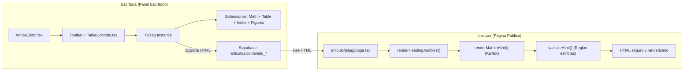

# Editor & Rendering Codemap — Cerna Pensamento

**Última actualización:** 2026-09-17  
**Puntos de entrada:** `src/components/escritorio/ArticleEditor.tsx`, `src/app/[lang]/articulo/[slug]/page.tsx`

---

## 1. Arquitectura del Editor de Contenidos

El editor de artículos de Cerna está construido con **TipTap 3** (sobre ProseMirror) y enriquecido con extensiones personalizadas para soportar estándares editoriales y científicos.



---

## 2. Extensiones TipTap Personalizadas (`src/lib/editor/`)

### 1. Fórmulas Matemáticas (`MathExtensions.ts`)
- **Dependencia**: `@tiptap/extension-mathematics` y `katex` (`^0.16.21`).
- **Capacidades**: Sencillo soporte para expresiones matemáticas tanto en línea (`$E = mc^2$`) como en bloque (`$$\int_{a}^{b} f(x)dx$$`).
- **Renderizado en Vivo**: Utiliza KaTeX en tiempo real en el editor y compila a HTML estándar para su lectura pública.

### 2. Tablas Avanzadas (`TableExtensions.ts` y `TableControls.tsx`)
- **Dependencia**: `@tiptap/extension-table`, `table-row`, `table-cell`, `table-header`.
- **Capacidades**: Tablas redimensionables, soporte de cabeceras, fusión de celdas y personalización del color de fondo de celdas individuales.
- **Barra de Herramientas Flotante**: `TableControls.tsx` ofrece controles contextuales para añadir o eliminar filas/columnas, combinar celdas y aplicar estilos.

### 3. Índice de Artículo Jerárquico (`ArticleIndexExtension.ts`, `generateIndex.ts`)
- **Tipo de Nodo**: `article-index`.
- **Generación Automática**: `generateIndex.ts` recorre el documento HTML o AST de ProseMirror, extrae los encabezados `H1`, `H2` y `H3`, y calcula una ruta topológica jerárquica (`path: number[]`).
- **Anchors Seguros**: `renderHeadingAnchors.ts` inyecta automáticamente atributos `id="heading-slug"` estables en los encabezados para permitir navegación por anclas desde el índice.
- **Migración de Compatibilidad**: `parseHTML` cuenta con transformadores de tolerancia a fallos para documentos guardados con esquemas antiguos (`level`/`num`).

### 4. Imágenes Editoriales con Pie (`FigureExtension.ts`)
- Formato semántico `<figure><figcaption>Pie de foto</figcaption></figure>`.
- Manejo de ratios de aspecto y leyendas centradas en cursiva.

### 5. Control de Tamaño Tipográfico (`FontSizeExtension.ts`)
- Permite a los redactores ajustar el tamaño del texto para citas, notas al pie o énfasis sin romper la jerarquía semántica de encabezados.

---

## 3. Pipeline de Sanitización y Seguridad (`articulo/[slug]/page.tsx`)

Para prevenir vulnerabilidades **XSS (Cross-Site Scripting)** derivadas de contenido HTML enriquecido, el renderizador público pasa todo el contenido por un estricto pipeline:

```typescript
const cleanHtml = sanitizeHtml(
  renderHeadingAnchors(renderMathInHtml(contenido)),
  {
    allowedTags: [...defaults, 'table', 'thead', 'tbody', 'tr', 'th', 'td', 
                 'span', 'math', 'svg', 'path', 'line', 'nav', 'figure', 'figcaption'],
    allowedAttributes: {
      div: ['class', 'style', 'data-type', 'data-latex', 'role'],
      span: ['class', 'style', 'aria-hidden', 'data-type', 'data-latex'],
      nav: ['data-type', 'data-items', 'lang', 'class', 'style', 'aria-label'],
      h1: ['id'], h2: ['id'], h3: ['id'],
      a: ['href', 'class', 'style'],
      th: ['style', 'colspan', 'rowspan'],
      td: ['style', 'colspan', 'rowspan']
    },
    allowedStyles: {
      '*': {
        'color': [/./],
        'background-color': [/./],
        'text-align': [/./],
        'font-size': [/./],
        'transition': [/./]
      }
    }
  }
);
```

> **Regla Crítica**: Todo nuevo elemento o estilo inline generado por extensiones de TipTap debe ser añadido explícitamente a las listas blancas de `sanitizeHtml` en `articulo/[slug]/page.tsx`, o será filtrado silenciosamente en producción.
