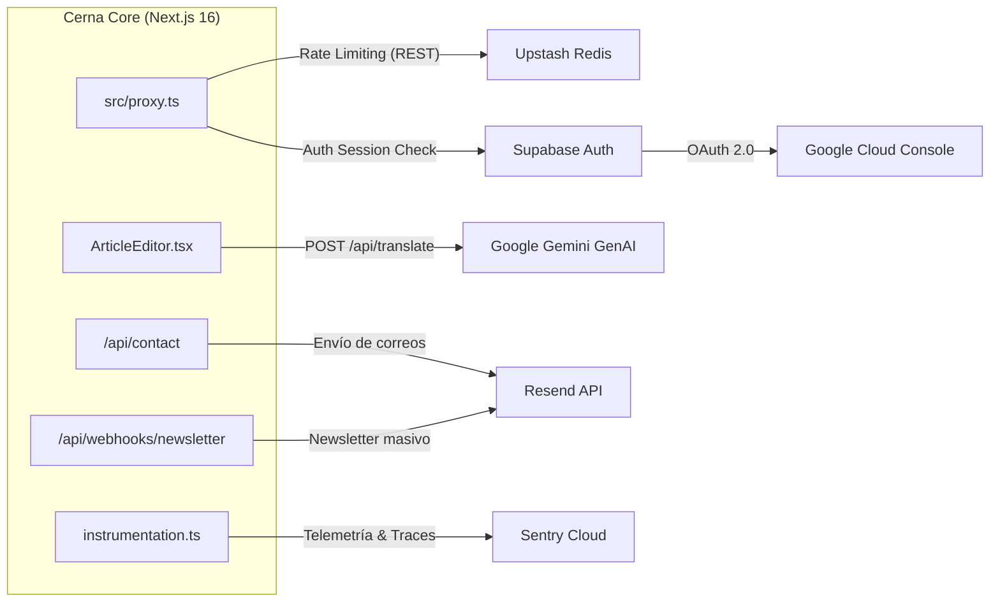

# Integrations Codemap — Cerna Pensamento

**Última actualización:** 2026-09-17  
**Servicios externos conectados:** Supabase, Upstash Redis, Resend, Google Gemini AI, Google OAuth, Sentry

---

## 1. Mapa de Integraciones

---

## 2. Detalle de Servicios Externos

### 1. Supabase (BaaS)
- **Servicios utilizados**: PostgreSQL (Base de datos principal), GoTrue (Autenticación), Storage (Archivos multimedia) y Database Webhooks.
- **Configuración**:
  - `NEXT_PUBLIC_SUPABASE_URL`: Endpoint de la API REST / PostgREST.
  - `NEXT_PUBLIC_SUPABASE_ANON_KEY`: Utilizada en cliente y servidor con RLS.
  - `SUPABASE_SERVICE_ROLE_KEY`: Utilizada únicamente en Server Actions administrativas para omitir RLS cuando se validan permisos por código.
- **Webhooks**: Un webhook configurado en la tabla `articulos` dispara una petición HTTP POST a `/api/webhooks/newsletter` cuando la columna `estado` cambia a `publicado`.

### 2. Upstash Redis (Rate Limiting)
- **Propósito**: Protección contra ataques de fuerza bruta y abusos en endpoints y mutaciones globales.
- **Librería**: `@upstash/redis` y `@upstash/ratelimit`.
- **Implementación**: `src/proxy.ts` en Edge Runtime.
- **Políticas**:
  - Rutas API: 10 peticiones/minuto por IP.
  - Mutaciones HTTP (POST/PUT/DELETE): 30 peticiones/minuto por IP.

### 3. Resend (Email Delivery)
- **Propósito**: Proveedor transaccional de alta entregabilidad para:
  1. Envíos del formulario de contacto institucional hacia `contacto@cernapensamento.org`.
  2. Notificaciones del boletín periódico a los lectores suscritos.
- **Configuración**: `RESEND_API_KEY`, remitente verificado para el dominio `cernapensamento.org`.

### 4. Google Gemini GenAI
- **Propósito**: Asistente de traducción editorial automática gallego-castellano integrado en el panel de redacción.
- **Librería**: `@google/genai` (SDK oficial).
- **Modelo utilizado**: `gemini-2.5-flash`.
- **Endpoint**: `/api/translate`.

### 5. Sentry (Observabilidad y Rendimiento)
- **Propósito**: Monitorización de excepciones y errores en tiempo real en servidor, edge y cliente.
- **Librería**: `@sentry/nextjs`.
- **Configuración**: `sentry.server.config.ts`, `sentry.edge.config.ts` e `instrumentation-client.ts`.
- **Session Replay**: Muestreo al 0% en sesiones normales y 100% en sesiones con errores no controlados.
